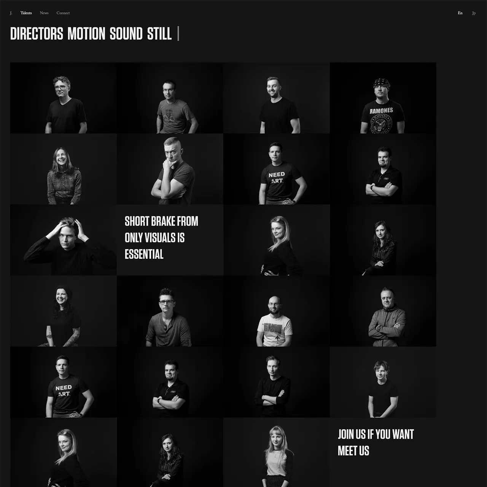

# thejuice

Front-end development based on Sketch files provided by the external client

## Preview
* [Homepage](https://piotrmerton.github.io/thejuice/index.html)
* [Talents listing](https://piotrmerton.github.io/thejuice/talents.html)
* [Talents filtered](https://piotrmerton.github.io/thejuice/talents-filtered.html)
* [Talents filtered: Directors](https://piotrmerton.github.io/thejuice/talents-filtered-directors.html)
* [Talent single](https://piotrmerton.github.io/thejuice/person.html)
* [Project Video](https://piotrmerton.github.io/thejuice/project-video.html)
* [Project Audio](https://piotrmerton.github.io/thejuice/project-audio.html)
* [News](https://piotrmerton.github.io/thejuice/news.html)
* [Contact](https://piotrmerton.github.io/thejuice/connect.html)
* [Search results](https://piotrmerton.github.io/thejuice/search-results.html)
* [Search results - autocomplete](https://piotrmerton.github.io/thejuice/search-results-autocomplete.html)
* [Search results - multiple filters](https://piotrmerton.github.io/thejuice/search-results-multiple-filters.html)
* [Search results - error message](https://piotrmerton.github.io/thejuice/search-results-message.html)

